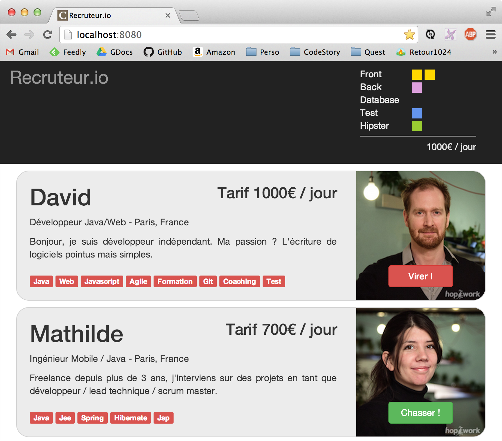

# Application Web Moderne en Java
## The CodeStory Way
by David Gageot & Jean-Laurent de Morlhon


## Abstract

Venez participer à un Hand's On Lab de 2-3 heures. L'objectif est simple : apprendre à développer une application web moderne en Java. Rapidement, de manière pragmatique et en toute confiance.

Avec l'assistance et les démos live de David Gageot et Jean-Laurent de Morlhon.

Au menu : du Java 8, un poil d'Angular, un soupçon de CoffeeScript, du MongoDB, du pair-programming, des tests IHM, des hotkeys de malade, des plugins de fou et un cycle de développement ultra rapide. Oui vous ne rêvez pas on parle bien de Java.

Lundi, au boulot, vous ne verrez plus votre projet java de la même manière.


# Install party

Pour faire cet atelier, tu as besoin  :
  * d'un portable avec de la batterie pour durer 3h de coding
  * d'un binôme
  * de logiciels :
    * Java 8
    * maven 3.1
    * node.js 0.10+
    * un repo maven "chauffé"
    * d'un IDE
    * de quelques "assets" de données et graphiques

Tu trouveras tout ça sur une clé USB que nous te distribuons au début de la session.

# Recruteur.io

Votre ami Jean-Claude de SupDeCo Aurillac a une idée de business de malade, Mark Zuckerberg en tremble encore :
il s'agit de faire un site pour trouver des grouillots modernes, des programmeurs, pour se faire une tonne de $$$ en les
plaçant dans des structures qui font des projets web.

Le truc c'est que visiblement les programmeurs ont des talents différents et que pour faire une bonne équipe, il faut
mixer ces talents.
Entre recherche de mots clés (ex: cherche stagiaire, 7 ans d'expérience en j2ee, vba et golo est un plus), ce que tous
les sites font, il faut plutôt être sur qu'ils soient bons dans un certain nombre de caractéristiques utiles aux
projets d'aujourd'hui.

En 2014, il nous faut 4 talents : `Front`, `Back`, `Database`, `Test`. Pour faire chouette et parce que c'est plus
vendeur, on veut aussi un coefficient `Hipster`.

Donc le site doit optimiser le prix (le nerf de la guerre d'après Jean-Claude, et il sait de quoi il parle: il a une BM)
mais aussi ces 5 caractéristiques.

Ca pourrait ressembler à ça :



Martine de la compta, a déjà acheté le nom de domaine, y'a plus qu'à.
On t'a installé Frontpage et IIS, let's go ! T'as 2h.

# Let's write some code

## Démarrer le serveur

1. Crées toi un répertoire tout neuf, dans lequel tu ajoute un `pom.xml` qui pourrait ressembler à ça :

```xml
<project xmlns="http://maven.apache.org/POM/4.0.0" xmlns:xsi="http://www.w3.org/2001/XMLSchema-instance"
         xsi:schemaLocation="http://maven.apache.org/POM/4.0.0 http://maven.apache.org/maven-v4_0_0.xsd">
  <modelVersion>4.0.0</modelVersion>

  <groupId>net.mix-it</groupId>
  <artifactId>recruteurio</artifactId>
  <version>1.0-SNAPSHOT</version>

  <properties>
    <maven.compiler.source>1.8</maven.compiler.source>
    <maven.compiler.target>1.8</maven.compiler.target>
    <project.build.sourceEncoding>UTF-8</project.build.sourceEncoding>
  </properties>

  <dependencies>
    <dependency>
      <groupId>net.code-story</groupId>
      <artifactId>http</artifactId>
      <version>2.9</version>
    </dependency>
  </dependencies>
</project>
```

1. Ensuite tu te crées comme un grand les répertoires de sources et de tests qui vont bien.
(Tu peux aussi utiliser ta souris, mais ça fait moins hype)

```bash
mkdir -p src/{main,test}/java
```

1. On est là pour faire du web. Alors allons-y pour un Hello World classique (c'est bien le classique aussi parfois).
  Tu peux créer un fichier `index.html` à la racine d'une répertoire
  `app` a coté de ton `pom.xml`

```bash
mkdir app
touch index.html
```

Ensuite tu édites `index.html` et tu colles dedans ça par exemple :

```html
---
layout: default
title: hello mix-it
---

<h1>Hello mix-it</h1>

Je sers une page web avec un projet java en moins de 2 minutes... si si c'est possible
```

La section entre les tirets, c'est du Yaml Front Matter.

Dans fluent-http, tout ce qui est dans le répertoire `app` est servi par défaut à la racine de ton serveur.
Si tu y mets du Html il sera servi tel quel, comme pour le Js, les images etc..
Si tu y mets du Less, il sera compilé en Css, du Coffee en Js, du Markdown en Html, etc...

1. Bon on code du java ou pas ? :

  Dans `src/main/java` tu ajoutes une classe `Server`. Celle là par exemple :

```java
package com.acme;

import net.codestory.http.*;

public class Server {
  public static void main(String[] args) {
    new WebServer().start();
  }
}
```

1. Exécute la classe `Server` et pointe ton navigateur sur http://localhost:8080
Normalement, là, tu as moins envie d'utiliser weblo et tomcat, lundi au boulot.

## Des moustaches coté serveur avec Handlebars

 1. Tu peux définir tes propres variables dans le YAML front matter

```Html
---
layout: default
title: hello mix-it
conference: mix-it
---

<h1>Hello [[conference]] !</h1>
```

Sans redémarrer ton serveur, le fichier sera servi et le traitement sera fait coté serveur.

Le langage de template ici est du [Handlebars](http://handlebarsjs.com/). Tu peux donc utiliser toutes les commandes
handlebars comme par exemple:

### Boucle

Avec une liste de personne comme cela :

 ```yaml
 coders:
  - firstName: Jean-Laurent, lastName: de Morlhon
  - firstName: David, lastName: Gageot
 ```
 (c'est comme ça qu'en Yaml on fait un tableau, on pense aussi que c'est moche, mais c'est comme ça)

Tu peux les afficher avec une boucle comme ceci:

```
[[#each people]]
  [[firstName]] [[lastName]]
[[/each]]
```

### Condition

```html
<div class="entry">
  [[#if author]]
  <h1>[[firstName]] [[lastName]]</h1>
  [[/if]]
</div>
```

Il y a d'autres éléments, mais guère plus, que tu peux voir dans http://handlebarsjs.com/.

### Ajouter bootstrap

Pour ajouter bootstrap tu peux utiliser les webjars. Ajoutes à ton pom :

```xml
<dependency>
  <groupId>org.webjars</groupId>
  <artifactId>bootstrap</artifactId>
  <version>3.1.1</version>
</dependency>
```

Tu peux accéder en utilisant le chemin `/webjars/bootstrap/3.1.1/css/bootstrap.css` dans une balise styles.
Si tu utilise le YAML Front Matter tu peux carrément le rajouter dans le header :

```YAML
---
title: recruteur.io
styles: ['/webjars/bootstrap/3.1.1/css/bootstrap.css']
---
```

Tu peux agir de la même manière avec toutes tes dépendances front.

Sinon il y a [bower](http://bower.io/). C'est plus hype mais tu dois déplacer les fichiers à la main.

### Fichiers de data externes (optionel)

/!\ à faire que si t'es une rock star, y'a plein de truc bien marrant aprés et ca serait dommage que tu les rates pour ça, maintenant si la génération statique de site te botte, fonce.

Le repertoire `app/_data` peut contenir des fichiers json ou yaml qui sont directement accessible coté serveur.
Si tu creer un fichier hello.json dans `app/_data` comme suis :
```json
{"greetings":"Hello World"}
```
Tu peux ajouter dans une page html le code suivant :

```html
<h1>Exemple de fichier de données</h1>
[[site.data.hello.greetings]]
```
Et *blam* du templating coté serveur à base de fichier, ca ressemble dangereseuement à Jekyll, c'est normal, c'est même copié de là ;)


# Server Side Stuff don't suck

## Angular

Tu peux écrire tes controlleurs angular en coffee, avec une syntaxe de classe, cela te permet d'isoler facilement les éléments.
par exemple :

```coffee
angular.module 'mix-it', []

.controller 'MyController', class
    constructor: (@$http) ->
      @info = "Hello World"
      @basket = {}

    search: ->
      @$http.get("/basket").success (data) =>
        @basket = data

```

Il te suffit ensuite de coller un entête ng-app dans le yaml front matter comme cela :

```yaml
---
title: Hello world angular
ng-app:mix-it
---
<div ng-controller="MyController as controller">
  {{controller.info}}
  <a href="" ng-click="controller.search()">search</a>
</div>
```

## Service REST Simple

Fluent-http expose vos en json beans par défaut.

Par exemple pour retourner une personne qui pourrait être défini comme cela :

```Java
public class Person {
  public String name;
  public int age

  public Person(String name, int age) {
    this.name = name;
    this.age = age;
  }
}
```

Vous pouvez facilement ajouter une ressource à votre serveur http comme cela :

```Java
public class PersonResource {

  @Get("/douglas")
  public Person getPerson() {
    return new Person("Scott Adams",42);
  }
}
```

Vous le branchez dans vos routes :

```Java
package com.acme;

import net.codestory.http.*;

public class Server {
  public static void main(String[] args) {
    new WebServer(routes -> routes.add(PersonResource.class).start();
  }
}
```

Et en appelant http://localhost:8080/douglas vous obtenez :

```json
{
  "name":"Scott Adams",
  "age":42
}
```

# Tests unitaires, intégrations, javascript, d'interfaces !

## Tester unitairement ses resources avec JUnit

Rien d'extraordinaire dans cette section.

Nous utilisons des utilitaires de tests bien connus, comme assertj (un fork de fest-assert) et mockito

Tu peux les ajouter facilement à ton pom en ajoutant :

```xml
    <dependency>
      <groupId>org.assertj</groupId>
      <artifactId>assertj-core</artifactId>
      <version>1.6.0</version>
      <scope>test</scope>
    </dependency>

    <dependency>
      <groupId>org.mockito</groupId>
      <artifactId>mockito-all</artifactId>
      <version>1.9.5</version>
      <scope>test</scope>
    </dependency>
```

## Tester en intégration ses resources avec RestAssured

Les tests d'intégration au niveau resource sont interessants car ils vérifient si notre application est proprement wrappée dans une resource REST.
On va se concentrer sur les entrées/sorties http.

On utilise pour cela RestAssured, qui propose une API fluent pour décrire ces tests qui sont parfois assez complexes à écrire.

```xml
    <dependency>
      <groupId>com.jayway.restassured</groupId>
      <artifactId>rest-assured</artifactId>
      <version>2.3.1</version>
      <scope>test</scope>
    </dependency>
```

Un test RestAssured à besoin du serveur pour tourner, mais plutôt que de les lancer avec les tests d'intégration, avec faisafe, nous préférons les utiliser comme des tests unitaires.
Il est parfaitement possible d'executer cela dans un test unitaire a condition que le serveur soit capable de démarrer trés rapidement.
Il se trouve que fluent-http est trés bon dans ce domaine.


Pour éviter les conflits en cas de parallelisations des tests, fluent-http possède une méthode `startOnRandomPort` qui permet d'être sûr d'éviter les conflits de bind.

```java
public class BasketRestTest {
  WebServer webServer;

  @Before
  public void startServer() {
    webServer = new WebServer().startOnRandomPort();
  }

  @Test
  public void two_developers() {

    RestAssured
        .given().port(webServer.port())
        .when().get("/basket?emails=david@mix-it.io,jl@mix-it.io").
        then().body("grade", equalTo(4)).
        and().body("sum", equalTo(2000));
  }

}
```

## Tester unitairement ses controlleurs Angular avec Karma

On peut tester unitairement son controleur Angular.

On utilise Karma, en conjonction avec Jasmine pour cela.
Il faut que les fichiers de angular soient disponibles dans le path.
Si tu utilises les webjars, c'est le bon moment pour lancer un `bower install` dans ta console.

Utilise le fichier de configuration de karma que tu trouveras sur la clé USB
Si tu n'as pas Chrome sur ta machine tu peux ouvrir le fichier de configuration et remplacer `chrome` par `safari`, `firefox`... ou `ie` !

Le test se lance en tapant `karma start karma.conf.coffee`
(si karma n'est pas dans ton path, tu peux le trouver dans node_modules/karma/bin/karma`)

```coffee
expect = chai.expect

describe 'basket controller unit test', ->

  beforeEach ->
    module 'mix-it'
    localStorage['emails']=''

  it 'should find a basket controller', ->
    expect(@BasketController).not.to.equal null

  it 'should call the method inside a controller with emails', inject ($controller, $httpBackend) ->
    localStorage['emails']='["foo@bar.com"]'
    $httpBackend.expectGET('/basket?emails=foo@bar.com').respond
      '{"test":0,"back":0,"database":0,"front":0,"hipster":0,"sum":0}'

    controller = $controller 'BasketController'

    $httpBackend.flush()

    expect(controller.emails).to.eql ['foo@bar.com']
```

## Tester son application avec Protractor

Protractor permet de tester l'application dans sa globalité, avec une surcouche anciennement appelée `ng-scenario` qui permet d'accéder directement
au scope angular, si besoin.

Protractor a besoin de Selenium, il faut que tu l'installes en tapant la commande suivante : `webdriver-manager -update`
Si tu ne trouves pas webdriver-manager dans ton path, tu le trouveras ici : `node_modules/protractor/bin/webdriver-manager`

N'oublie pas de lancer ton serveur avant d'executer ce test.

Il se lance en executant la commande `protractor protractor.conf.coffee`

Si protractor n'est pas dans ton path, tu le trouveras dans `node_modules/protractor/bin/protractor`)

```coffee
describe 'End to end test', ->
  beforeEach ->
    browser.get '/'

  it 'should update the basket with two developers', ->
    element(By.css('#clear')).click()
    element(By.css('#David .btn-success')).click()
    element(By.css('#Mathilde .btn-success')).click()

    expect(element(By.css('#basket .text-right')).getText()).toContain '1700'
```

Protractor te permet aussi d'utiliser la fonction `By.model` qui te sert à réagir au modèle angular sous-jascent : `By.model('someAngularVariableInScope')`
Il y a aussi la fonction `By.binding` qui peut être utilisée par exemple avec : `By.binding('{{someVariableInScope}}')`

Attention tout élément est une promesse. Ppour faire un simple `console.log` il faut faire comme cela :

```coffee
  element(By.id('view-container')).getText().then (text) ->
    console.log text
```

Idem avec des tableaux :

```coffee
  it 'should find the right number of front skill for dgageot', ->
    element(By.css('#clear').click()
    element(By.css('#David .btn-success').click()
    element.all(By.css('.box.front:not(.ng-hide)')).then (array) ->
      expect(array.length).toEqual 2
```

-- David & Jean-Laurent
